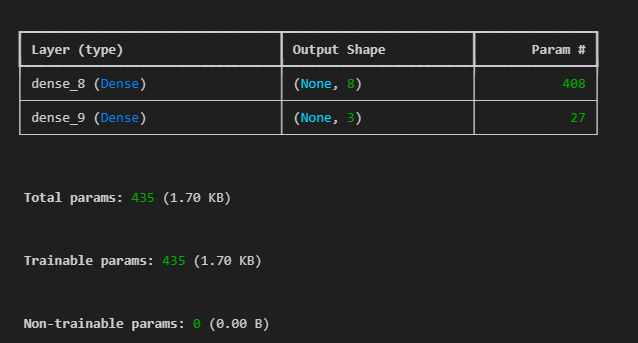
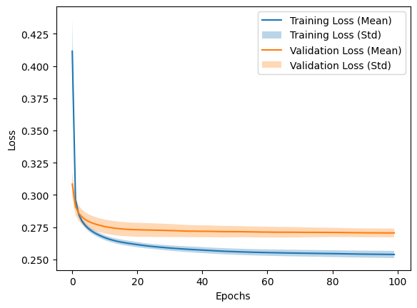
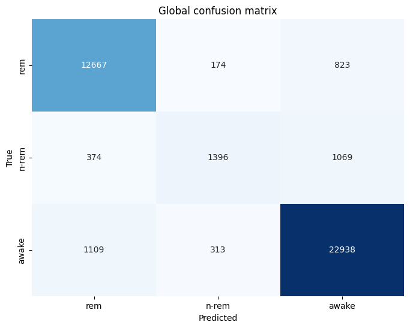

# Practical Work 03 – Mice’s sleep stages classification with MLP


## Experiment 1

### Model summary


### Training history plot


### Performance result


Mean F1-score across all folds: ~0.906

### Analysis

Our model has good predictive capabilities, as demonstrated by its F1-score of 0.90. This score shows the model's balanced performance across both target classes, indicating good learning and generalization. The training and validation loss curves have a smooth and convergent pattern. The parallel alignment of these curves at the end of the training, close to the X-axis, shows that the model has reached an optimal point of learning.  This indicates that extending the number of epochs would not improve the model further. This good metrics between the training and validation phases confirm the absence of overfitting, so it ensures that our model can generalize well to new, unseen data.

## Experiment 2

### Model summary


### Training history plot


### Performance result


Mean F1 Score across all folds: 0.8759928322673641


### Analysis

In transitioning to a three-class system, we made modifications to our model's architecture and data encoding. We implemented the OneHotEncoder from `sklearn.preprocessing`, transforming our class labels into one-hot encoded vectors ([0,0,1], [0,1,0], [1,0,0]). To align with the one-hot encoding and manage the multi-class output, we adapted our network's architecture. We increased the output layer by adding two additional neurons, resulting in a total of three neurons corresponding to the three classes. We also replaced the tanh activation function with softmax in the output layer because the softmax function is more suited for multiclass classification as it transforms the output into a probability distribution over the predicted classes, which directly supports our one-hot encoded targets. Additionally, to evaluate the model’s performance with the expanded class structure, we modified the existing code to display a 3x3 confusion matrix.

The model's performance has decreased compared to the last experimen. It struggled with the identification of the n-rem occurrence. This challenge can  be attributed to the under-representation of the n-rem class in the training dataset, suggesting a need for either more balanced data or other techniques to handle class imbalance effectively (what we've done for the competition). 

## Competition

### SMOTE

Because n-rem class is under represented, we tried to balance it using SMOTE (Synthetic Minority Oversampling Technique)
we used the imbalanced-learn package to achieve this. 
There is different sampling strategy, we used the basic SMOTE because we didn't want to go to far with this idea.
sadly it didn't improve our model and sometimes even made f1_score worse.

Smote is very easy to implement, when training we pass our x_train y_train to the SMOTE() function to balance our training data.

```python
  x_train, y_train = smote.fit_resample(x_train, y_train)
```

### ANOVA

We tried to choose the best feature amongst the 100 feature we had in our dataset.
To achieve this we used the AVORA coefficient to calculate the variance of our features.

we used sklearn.feature_selection's f_classif function to calculated it.

```python
anova_corr_coef, _ = f_classif(features, target)
```

Choosing the feature with highest ANOVA coefficient improved our model and even more when adding more feature.

### More feature

Adding more feature made our model better.
We tried 25, 50, 75, 100 features.

The more feature we added, the easiest the model could be overfitted.

### KerasTuner

We decided to implement the KerasTuner to find the best hyperparameter for our models. 

#### First try

We edited the create_model() function to tune nearly all hyperparameters.

We tried to tune the following parameters of our model:

- Adding or not second layer
- Both layers had either 2,4 or 8 neurons
- Both layers's activation function (sigmoid or ReLu)
- The optimizer (adam or sgd)
- Learning rate (0.01,0.001, or 0.0001)
- Momentum (0, 0.8 or 0.99)
- loss function (k1_divergence, categorical cross-entropy)

Because we used the GridSearch (try every combination possible) we ended up with way too much tries
so I reduced some of the choice

Reduce both layer neurons to only 4 or 8
Remove loss function and stick with categorical cross-entropy
Remove 0 momentum
Remove 0.01 learning rate

```python

def create_model(hp):
 
  has_second_layer = hp.Boolean("has_second_layer")

  mlp = keras.Sequential()
  mlp.add(layers.Input(shape=(25,)))
  mlp.add(layers.Dense(hp.Choice("first_nb_neurons",[4,8]), activation=hp.Choice("activation",["relu","sigmoid"])))
  
  if(has_second_layer):
    mlp.add(layers.Dense(hp.Choice("second_nb_neurons",[4,8]),activation=hp.Choice("activation2nd",["relu","sigmoid"])))
           
  mlp.add(layers.Dense(3, activation="softmax"))
  
  learning_rate = hp.Choice("learning_rate", [0.001, 0.0001])
  momentum = hp.Choice("momentum", [0.8,0.99])
 
  optimizer_name = hp.Choice('optimizer', values=['adam', 'sgd'])

  if optimizer_name == 'adam':
      optimizer = keras.optimizers.Adam(learning_rate=learning_rate)
  else :
      optimizer = keras.optimizers.SGD(learning_rate=learning_rate,momentum=momentum)
 
  mlp.compile(
      optimizer=optimizer,
      loss="categorical_crossentropy",
      metrics=[keras.metrics.F1Score(average="weighted")]
  )

  return mlp

tuner = kt.GridSearch(
    create_model,
    objective= kt.Objective("f1_score", direction="max"),
    overwrite=True,
    directory="./tuning",

)

```
After 5 hours of search, VSCode crashed because it ran out of memory. 

#### Second try

Even tho VSCode crashed, we had a good overview of some of the best hyper-parameters.

We edited KerasTuner and remove some more hyper-parameters and keep only those who we were still unsure.

We kept : 

Both layer's activation function (sigmoid or ReLu)
Both layer 8 neurons 
Optimizer: ADAM
Learning rate : 0.01
Loss function : Categorical cross-entropy


```python

def create_model(hp):

  mlp = keras.Sequential()
  mlp.add(layers.Input(shape=(25,)))
  mlp.add(layers.Dense(8, activation=hp.Choice("activation",["relu","sigmoid"])))
  mlp.add(layers.Dense(8,activation=hp.Choice("activation2nd",["relu","sigmoid"])))
           
  mlp.add(layers.Dense(3, activation="softmax")) # Three ouput
  
  learning_rate = 0.001

  optimizer = keras.optimizers.Adam(learning_rate=learning_rate)
 
  mlp.compile(
      optimizer=optimizer,
      loss="categorical_crossentropy",
      metrics=[keras.metrics.F1Score(average="weighted")]
  )

  return mlp

tuner = kt.GridSearch(
    create_model,
    objective= kt.Objective("f1_score", direction="max"),
    overwrite=True,
    directory="./tuning",
)

```

Result : Sigmoid on first layer and Relu on the second layer seems to be the best one.

Training history : 


Performance :


Mean F1 Score across all folds: 0.885

#### Third try

We weren't happy with only 0.886 of F1_score, so we tried to add more neurons/layer to see if we can get a higher score without overfitting too much. We also tried more activation function, we found that leaky_relu was a good contender.

Mean F1 Score across all folds: 

### Model summary

This is our final model.



### Training history plot



### Performance result


Mean F1 Score across all folds: 0.9016155757218369

### Analyse

The model above was ran using the best hyper parameters found by KerasTuner, with the ANOVA coefficient applied to the features. 50 Feature were choosen. SMOTE wasn't active.

Choosing hyper parameters is tough and take a lot of time. We achieved a very good f1_score and we couldn't get a better model without overfitting it. 