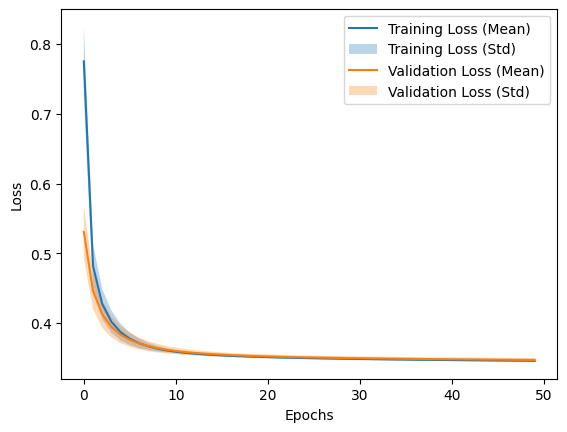

# Practical Work 03 – Mice’s sleep stages classification with MLP


## Experiment 1

### Model summary


### Training history plot



### Performance result


Mean F1 Score across all folds: ~0.906

### Analysis

We have a very good model that had a f1_score of 0.90. It performs well for both classes.
As we can see on the training history, we have a smooth cuve and the same performance for training and validation. We have no over fitting. The curve is parallel to the X axis, adding more Epoch isn't necessary.

## Experiment 2

### Model summary


### Training history plot


### Performance result


### Analyse

We had to make some change because we are now working with 3 classes instead of one.

We encoded our classes with OneHotEncoder from sklearn.preprocessing
It means that we went from 0 or 1 to [0,0,1] [0,1,0] [1,0,0].
We had to change our model and add 2 more neurons in the output layer and change the activation function from tanh to softmax.
We also had to change a bit of code to display the 3x3 confusion matrix.

The model is performing worse than with 2 classes. And it has a very hard time to identify n-rem occurence. We can explain this because n-rem is very under-represented.

## Competition

### Model summary

### Performance result

### Training history plot

### SMOTE

Because n-rem class is under represented, we tried to balance it using SMOTE (Synthetic Minority Oversampling Technique)
we used the imbalanced-learn package to achieve this. 
There is different sampling strategy, we used the basic SMOTE because we didn't want to go to far with this idea.
sadly it didn't improve our model and sometimes even made f1_score worse.

Smote is very easy to implement, when training we pass our x_train y_train to the SMOTE() function to balance our training data.

```python
  x_train, y_train = smote.fit_resample(x_train, y_train)
```


### ANOVA

We tried to choose the best feature amongst the 100 feature we had in our dataset.
To achieve this we used the AVORA coefficient to calculate the variance of our features.

we used sklearn.feature_selection's f_classif function to calculated it.

```python
anova_corr_coef, _ = f_classif(features, target)
```

Choosing the feature with highest ANOVA coefficient improved our model and even more when adding more feature.

### More feature

Adding more feature made our model better.
We tried 25, 50, 75, 100 features.

The more feature we added, the easiest the model could be overfitted.

### KerasTuner

We decided to implement the KerasTuner to find the best hyperparameter for our models. 

#### First try

We edited the create_model() function to tune nearly all hyperparameters.

We tried to tune the following parameters of our model:

- Adding or not second layer
- Both layer had either 2,4 or 8 neurons
- Both layer's activation function (sigmoid or ReLu)
- The optimizer (adam or sgd)
- Learning rate (0.01,0.001, or 0.0001)
- Momentum (0, 0.8 or 0.99)
- loss function (k1_divergence, categorical cross-entropy)

Because we used the GridSearch (try every combination possible) we ended up with way too much tries
so I reduced some of the choice

Reduce both layer neurons to only 4 or 8
Remove loss function and stick with categorical cross-entropy
Remove 0 momentum
Remove 0.01 learning rate

```python

def create_model(hp):
 
  has_second_layer = hp.Boolean("has_second_layer")

  mlp = keras.Sequential()
  mlp.add(layers.Input(shape=(25,)))
  mlp.add(layers.Dense(hp.Choice("first_nb_neurons",[4,8]), activation=hp.Choice("activation",["relu","sigmoid"])))
  
  if(has_second_layer):
    mlp.add(layers.Dense(hp.Choice("second_nb_neurons",[4,8]),activation=hp.Choice("activation2nd",["relu","sigmoid"])))
           
  mlp.add(layers.Dense(3, activation="softmax"))
  
  learning_rate = hp.Choice("learning_rate", [0.001, 0.0001])
  momentum = hp.Choice("momentum", [0.8,0.99])
 
  optimizer_name = hp.Choice('optimizer', values=['adam', 'sgd'])

  if optimizer_name == 'adam':
      optimizer = keras.optimizers.Adam(learning_rate=learning_rate)
  else :
      optimizer = keras.optimizers.SGD(learning_rate=learning_rate,momentum=momentum)
 
  mlp.compile(
      optimizer=optimizer,
      loss="categorical_crossentropy",
      metrics=[keras.metrics.F1Score(average="weighted")]
  )

  return mlp

tuner = kt.GridSearch(
    create_model,
    objective= kt.Objective("f1_score", direction="max"),
    overwrite=True,
    directory="./tuning",

)

```
After 5 hours of search, VSCode crashed because it ran out of memory. 

#### Second try

Even tho VSCode crashed, we had a good overview of some of the best hyper-parameters.

We edited KerasTuner and remove some more hyper-parameters and keep only those who we were still unsure.

We kept : 

Both layer's activation function (sigmoid or ReLu)
Both layer 8 neurons 
Optimizer: ADAM
Learning rate : 0.01
Loss function : Categorical cross-entropy


```python

def create_model(hp):

  mlp = keras.Sequential()
  mlp.add(layers.Input(shape=(25,)))
  mlp.add(layers.Dense(8, activation=hp.Choice("activation",["relu","sigmoid"])))
  mlp.add(layers.Dense(8,activation=hp.Choice("activation2nd",["relu","sigmoid"])))
           
  mlp.add(layers.Dense(3, activation="softmax")) # Three ouput
  
  learning_rate = 0.001

  optimizer = keras.optimizers.Adam(learning_rate=learning_rate)
 
  mlp.compile(
      optimizer=optimizer,
      loss="categorical_crossentropy",
      metrics=[keras.metrics.F1Score(average="weighted")]
  )

  return mlp

tuner = kt.GridSearch(
    create_model,
    objective= kt.Objective("f1_score", direction="max"),
    overwrite=True,
    directory="./tuning",
)

```

Result : Sigmoid on first layer and Relu on the second layer seems to be the best one.

Training history : 


Performance :


Mean F1 Score across all folds: 0.885

#### Third try

We weren't happy with only 0.886 of F1_score, so we tried to add more neurons/layer to see if we can get a higher score without overfitting too much. We also tried more activation function, we found that leaky_relu was a good contender.

Mean F1 Score across all folds: 

### Conclusion

Choosing hyper parameters is tough and take a lot of time. We achieved a very good f1_score and we couldn't get a better model without overfitting it. 